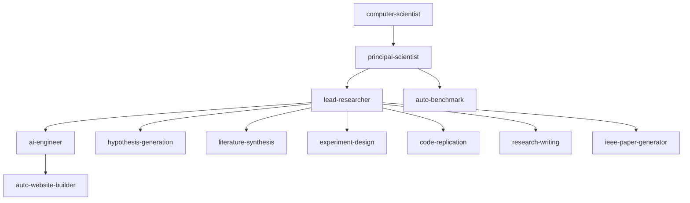
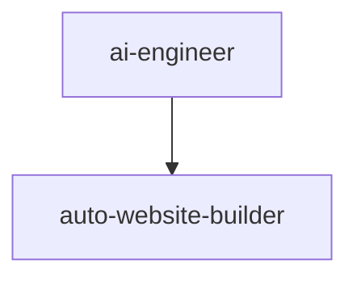
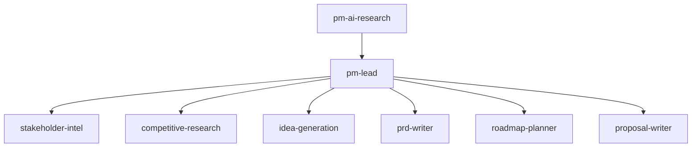
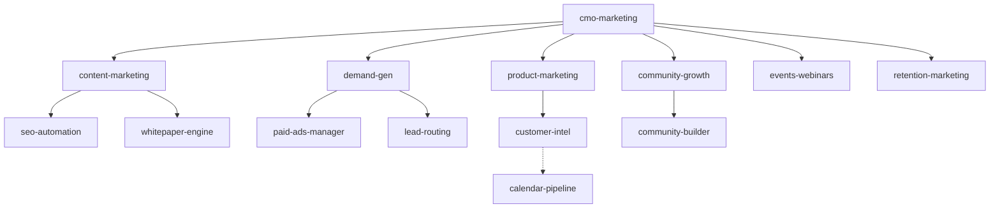

<p align="center">
  
  <h1 align="center">Open Org</h1>
</p>

<p align="center">
  <strong>The World's First Fully Autonomous Organization - Building 1-Person Unicorns</strong>
</p>

<p align="center">
  <a href="https://github.com/aviskaar/open-org/blob/main/LICENSE">
    
  </a>
  <a href="https://github.com/aviskaar/open-org/issues">
    
  </a>
  <a href="https://github.com/aviskaar/open-org/pulls">
    
  </a>
  <a href="https://agentskills.io/specification">
    
  </a>
</p>

---

## 🚀 Quick Start

```bash
# Clone the repo
git clone https://github.com/aviskaar/open-org.git
cd open-org

# Browse available skills
ls skills/

# Load a skill into Claude Code with one command
/plugin install aviskaar/open-org#lead-researcher
```

---

## 🌐 Vision

OpenOrg generalizes AI skills for enterprise automation, enabling fully autonomous organizations run by one person – scaling to unicorn status while prioritizing human good. By open-sourcing the skill layer, we give every builder the same leverage that once required entire departments.

---

## 🛠️ Core Features

- **🤖 Multi-AI model support** — Skills work across Claude, GPT, Gemini, and any model that accepts a system prompt.
- **🏢 Org-wide automation** — Pre-built hierarchies cover Research, Engineering, GTM, Marketing, and Operations end-to-end.
- **🔗 Composable skill stacks** — Orchestrator skills chain specialist skills, mirroring real team structures.
- **📦 Open-source extensibility** — Fork any skill, publish your own, and share across the community.
- **⚡ Agentic teams support** — Coordinate multi-agent pipelines using the [Agent Teams](AGENTS.md) model for parallel, autonomous execution.

---

## 📖 Table of Contents

- [Quick Start](#-quick-start)
- [Vision](#-vision)
- [Core Features](#️-core-features)
- [What are Skills?](#-what-are-skills)
- [Available Skills](#-available-skills)
  - [Research Skills](#research-skills)
  - [Engineering Skills](#engineering-skills)
  - [Enterprise / Operations Skills](#enterprise--operations-skills)
  - [GTM / Sales Skills](#gtm--sales-skills)
  - [Marketing Skills](#marketing-skills)
- [Using Skills](#-using-skills)
- [Creating a Skill](#-creating-a-skill)
- [Contributing](#-contributing)
- [Roadmap](#-roadmap)
- [Repository Structure](#-repository-structure)
- [License](#-license)

---

**Skills** are portable packages of instructions, scripts, and resources that an AI agent loads dynamically to achieve deep, domain-specific expertise. Each skill follows the [Agent Skills Specification](https://agentskills.io/specification), making them composable, version-controlled, and shareable.

---

## 🛠 What are Skills?

A skill lives in its own directory with a `SKILL.md` file at the root. This structure allows agents to understand both the high-level intent and the low-level execution details required for specialized tasks.

```text
my-skill/
├── SKILL.md          # Required: instructions + metadata frontmatter
├── scripts/          # Optional: executable helpers
├── references/       # Optional: additional docs loaded on-demand
└── assets/           # Optional: static resources, templates, data
```

---

## 🏗 Available Skills

### Research Skills
Orchestration for AI/ML research — from ideation and literature review to publication-ready papers.

#### Orchestration Hierarchy


| Skill | Layer | Description |
|-------|-------|-------------|
| [computer-scientist](skills/computer-scientist/) | Strategic | Survey research domains and formulate high-impact open problems. |
| [principal-scientist](skills/principal-scientist/) | Portfolio | Manage parallel research tracks and synthesize multi-track findings. |
| [lead-researcher](skills/lead-researcher/) | Project | End-to-end research orchestrator from hypothesis to publication. |
| [ai-engineer](skills/ai-engineer/) | Engineering | Transform research papers into production-ready product architectures. |
| [auto-benchmark](skills/auto-benchmark/) | Continuous | Continuous competitive benchmarking loop to defend #1 rankings. |
| [hypothesis-generation](skills/hypothesis-generation/) | Task | Generate and stress-test novel research hypotheses. |
| [literature-synthesis](skills/literature-synthesis/) | Task | Synthesize findings across a large body of research papers. |
| [ieee-paper-generator](skills/ieee-paper-generator/) | Task | Generate publication-ready IEEE conference and journal papers. |

### Engineering Skills
Transforming research into products with high-converting web presence.

#### Engineering Hierarchy


| Skill | Layer | Description |
|-------|-------|-------------|
| [ai-engineer](skills/ai-engineer/) | Lead | Owns the full engineering pipeline, PRD, and tech stack design. |
| [auto-website-builder](skills/auto-website-builder/) | Task | Produces investor-grade websites and complete Next.js codebases. |

### Enterprise / Operations Skills
Real-time agent construction for enterprise platforms.

| Skill | Description |
|-------|-------------|
| [dynamic-enterprise-agent](skills/dynamic-enterprise-agent/) | Build deployable AI agents on-the-fly for ServiceNow, Salesforce, AWS, and more. |

### GTM / Sales Skills
Product intelligence, pre-sales automation, and autonomous prospecting.

#### Product Intelligence Hierarchy


| Skill | Category | Description |
|-------|----------|-------------|
| [pm-ai-research](skills/pm-ai-research/) | Product | Portfolio-level PM intelligence and signal aggregation. |
| [pm-lead](skills/pm-lead/) | Product | End-to-end product discovery for specific product areas. |
| [proposal-automation](skills/proposal-automation/) | Pre-Sales | Transforms customer briefs into complete commercial packages and POCs. |
| [calendar-pipeline](skills/calendar-pipeline/) | Sales | Autonomous engine for C-suite prospecting and meeting generation. |

### Marketing Skills
Automating the full marketing department — from brand and content through demand generation and retention.

#### Marketing Team Hierarchy


| Skill | Layer | Description |
|-------|-------|-------------|
| [cmo-marketing](skills/cmo-marketing/) | Strategic | CMO orchestrator running strategy, budget, and cross-functional campaigns. |
| [content-marketing](skills/content-marketing/) | Orchestrator | VP Content: plans editorial calendar and multi-platform distribution. |
| [demand-gen](skills/demand-gen/) | Orchestrator | VP Demand Gen: orchestrates pipeline creation, paid ads, and lead routing. |
| [product-marketing](skills/product-marketing/) | Orchestrator | VP Product Marketing: positioning, messaging, and sales enablement. |
| [community-growth](skills/community-growth/) | Orchestrator | VP Community & Ecosystem: strategy across GitHub, Discord, and Slack. |
| [retention-marketing](skills/retention-marketing/) | VP | VP Lifecycle & Retention: maximize LTV through onboarding and NPS. |

---

## 🚀 Using Skills

### Claude Code
Install directly into your project:
```bash
/plugin install aviskaar/open-org#research-paper-review
```

### Claude.ai
Upload any `SKILL.md` file into a **Claude.ai Project** to activate it for your conversation.

### API Usage
Inject skill instructions into the `system_prompt` or use the dedicated Skills API (where available).

---

## ✍️ Creating a Skill

Start from the [template](template/SKILL.md). A valid skill requires YAML frontmatter:

```markdown
---
name: my-skill
description: "Use this skill when..."
metadata:
  author: your-name
  version: "1.0"
---

# Instructions
Detailed behavioral instructions go here.
```

**Best Practices:**
- **Trigger-focused:** Write descriptions as activation conditions.
- **Modular:** Keep `SKILL.md` under 500 lines; use `references/` for data.
- **Tooling:** Explicitly define `allowed-tools` if the skill requires environment access.

---

## 🤝 Contributing

We welcome contributions from the community! Skills live in the [/skills](skills/) directory — browse existing ones for inspiration.

**Steps to contribute:**
1. Fork the repo and create your branch: `skill/your-skill-name`.
2. Adhere to the [Agent Skills Specification](https://agentskills.io/specification).
3. Ensure no hardcoded credentials or proprietary data are included.
4. Open a Pull Request with a clear description of the use cases and problem being solved.

**Adding agent team workflows?** See [AGENTS.md](AGENTS.md) for how to document multi-agent coordination patterns.

---

## 📂 Repository Structure

```text
.
├── skills/                   # Individual skill packages
│   ├── hypothesis-generation/    # Research — task
│   ├── lead-researcher/          # Research — project orchestrator
│   ├── ai-engineer/              # Engineering — orchestrator
│   ├── cmo-marketing/            # Marketing — strategic orchestrator
│   └── ...
├── template/                 # Starter template for new skills
└── spec/                     # Agent Skills Specification reference
```

---

## 📈 Roadmap

| Milestone | Description | Status |
|-----------|-------------|--------|
| **v0.5 — Skill Library** | Publish 20+ production-ready skills across all org functions | ✅ In progress |
| **v1.0 — Autonomy Benchmarks** | Define and publish benchmarks for single-person org automation (research, GTM, engineering) | 🔜 Planned |
| **v1.5 — Agent Teams Integration** | First-class multi-agent orchestration with the [Agent Teams](AGENTS.md) model baked into every skill hierarchy | 🔜 Planned |
| **v2.0 — Enterprise Runtime** | Hosted skill execution, usage analytics, and SSO/RBAC for enterprise deployments | 🔜 Planned |
| **v3.0 — Unicorn Playbook** | End-to-end autonomous org template: one founder, full AI team, verified unicorn-track metrics | 🔜 Planned |

Have a feature request? [Open an issue](https://github.com/aviskaar/open-org/issues) or start a discussion.

---

## 📄 License

Unless otherwise specified in a skill's frontmatter, all content is licensed under the [Apache 2.0 License](LICENSE).

---

<p align="center">
  <i>Aviskaar — Advancing AI through open, composable tooling.</i>
</p>
